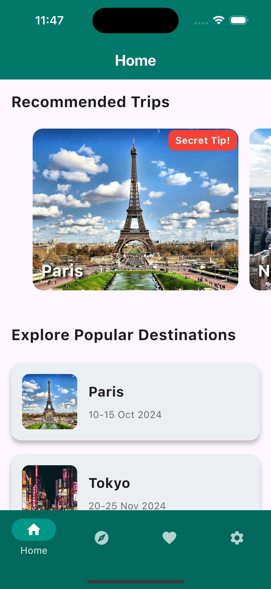
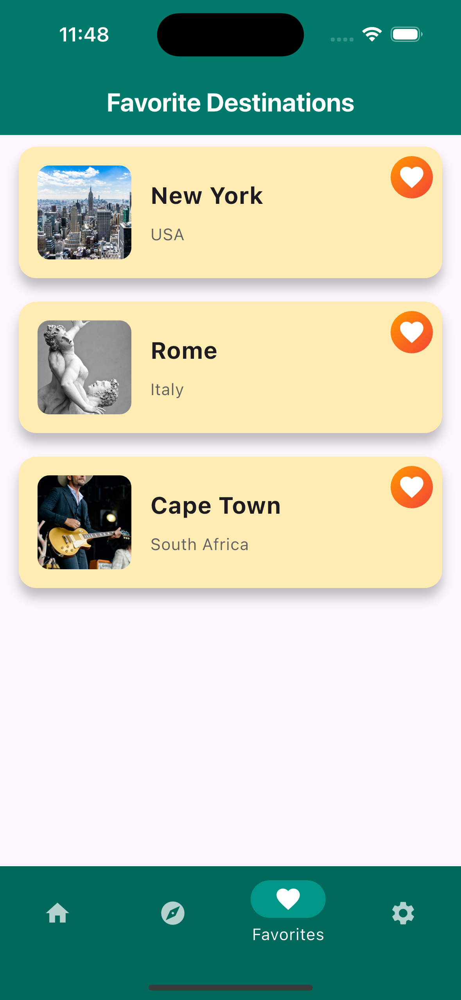
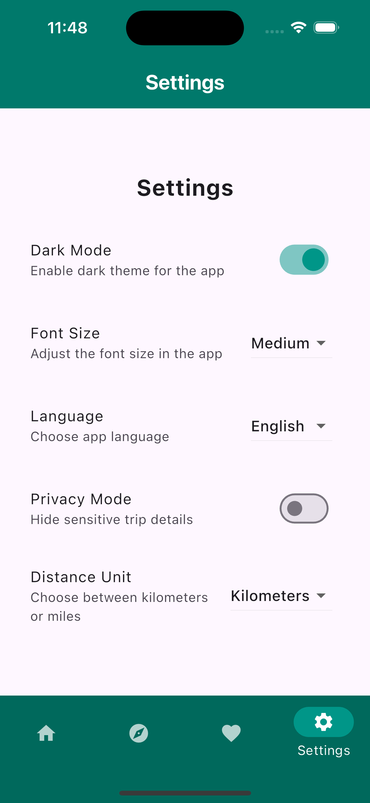

# aa_travel_planner

Eine mittelgroße App, die das Finden von Zielen und Reisen simuliert.

Neben dem Finden von Reisen und dem Erkunden von Zielen hat sie Funktionen wie Favoriten und Einstellungen.

## Idee

Mithilfe der App kann man sehen, wie schwer es ist, eine App zu verstehen, die schlecht oder gar nicht organisiert ist.

Außerdem ist dies ein Beispiel einer mittelgroßen App, dh. mit recht vielen unterschiedlichen Screens und ein bisschen Funktionalität.

Repositories werden genutzt, um die Daten der App zu speichern, zum Beispiel welche Reisen gemerkt und welche Einstellungen ausgewählt wurden.

## Einschränkungen

* In einer echten App sollten alle Klassen und Widgets in eigenen Dateien sein, und eine Ordnerstruktur sollte eingeführt werden.
* Außerdem sollte in einer echten App ein State Management verwendet werden, was in dieser App absichtlich weggelassen wurde.
* Manche Funktionalitäten sind nicht fertig implementiert.
* Die Settings haben noch keinen Effekt.
* Die App hat verschiedene Bugs 😀

## Die App starten

Möglicherweise musst du `flutter pub get` im Terminal ausführen oder `Flutter: Get Packages` in Visual Studio Code starten.

## Screenshots

Home Screen                       |  Favorites Screen          |  Settings Screen
:--------------------------------:|:-------------------------:|:-------------------------:
{width=150}  |  {width=150} |  {width=150}
